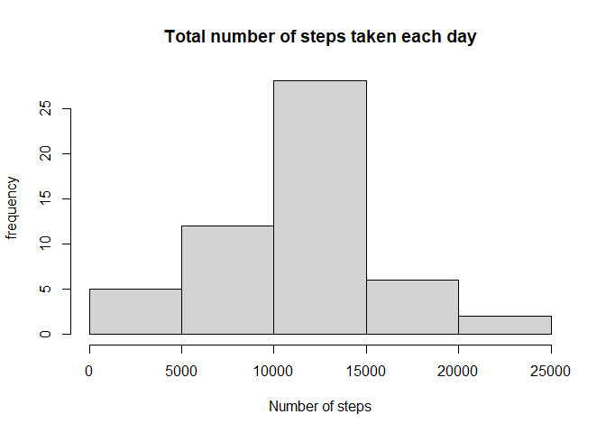
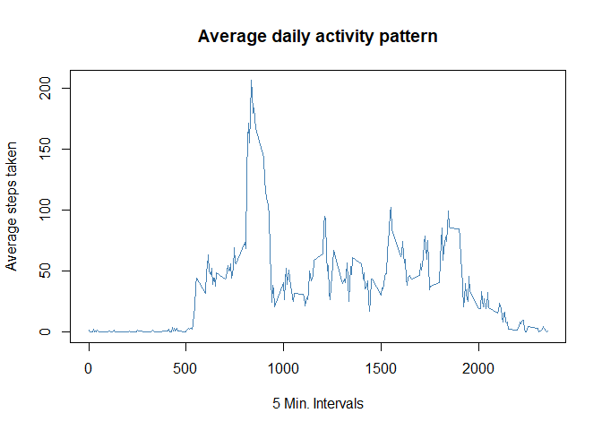
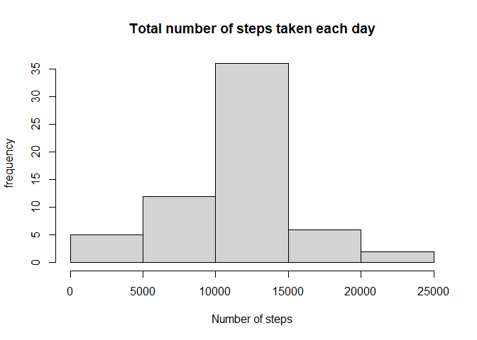

## Loading and preprocessing the data

```r
if(!file.exists("activity.csv")){
    unzip("activity.zip")
}
activity <- read.csv("activity.csv")
activity$date <- as.Date(activity$date)
summary(activity)
```

```
##      steps             date               interval     
##  Min.   :  0.00   Min.   :2012-10-01   Min.   :   0.0  
##  1st Qu.:  0.00   1st Qu.:2012-10-16   1st Qu.: 588.8  
##  Median :  0.00   Median :2012-10-31   Median :1177.5  
##  Mean   : 37.38   Mean   :2012-10-31   Mean   :1177.5  
##  3rd Qu.: 12.00   3rd Qu.:2012-11-15   3rd Qu.:1766.2  
##  Max.   :806.00   Max.   :2012-11-30   Max.   :2355.0  
##  NA's   :2304
```


## What is mean total number of steps taken per day?
1. Calculating the total number of steps taken per day 

```r
steps_by_day <- aggregate(steps~date , data = activity ,FUN = sum , na.rm = TRUE)
```
2. Make a histogram of the total number of steps taken each day

```r
hist(steps_by_day$steps , xlab="Number of steps" , ylab = "frequency" , main = "Total number of steps taken each day")
```

<!-- -->
3. Mean and Median of the total number of steps taken per day

```r
meanbyday <- format(mean(steps_by_day$steps),digits = 1)
medianbyday <- format(median(steps_by_day$steps) , digits = 1)
```
**Mean** : 10766
**Median** : 10765

## What is the average daily activity pattern?
1. Make a time series plot (i.e. \color{red}{\verb|type = "l"|}type = "l") of the 5-minute interval (x-axis) and the average number of steps taken, averaged across all days (y-axis)

```r
daily_activity <- aggregate(steps~interval,data = activity,FUN = mean , na.rm = TRUE)
plot(daily_activity$interval,daily_activity$steps,type = "l" , xlab = "5 Min. Intervals" , ylab = "Average steps taken" , main = "Average daily activity pattern",col = "steelblue")
```

<!-- -->

2. Which 5-minute interval, on average across all the days in the dataset, contains the maximum number of steps

```r
max_steps <- max(daily_activity$steps)
max_stepsinterval <- daily_activity$interval[which(daily_activity$steps==max_steps)]
```
**The interval Which contains maximum number of steps is : 835 **


## Imputing missing values
1. Calculating the total no. of missing values

```r
sum(is.na(activity$steps))
```

```
## [1] 2304
```
2. making the copy of data and replacing the NA's with mean

```r
copydata <- activity
nas <- is.na(copydata$steps)
avg_interval <- tapply(copydata$steps, copydata$interval, mean, na.rm=TRUE, simplify=TRUE)
copydata$steps[nas] <- avg_interval[as.character(copydata$interval[nas])]
```
3. 

```r
steps_per_day <- aggregate(steps~date , data = copydata ,FUN = sum , na.rm = TRUE)
hist(steps_per_day$steps , xlab="Number of steps" , ylab = "frequency" , main = "Total number of steps taken each day")
```

<!-- -->
4. mean and median total number of steps taken per day

```r
mean <- format(mean(steps_per_day$steps),digits = 1)
median <- format(median(steps_per_day$steps) , digits = 1)
```
**Mean** : 10766
**Median** : 10766

## Are there differences in activity patterns between weekdays and weekends?
1. Creating new factor variable

```r
library(dplyr)
```

```
## 
## Attaching package: 'dplyr'
```

```
## The following objects are masked from 'package:stats':
## 
##     filter, lag
```

```
## The following objects are masked from 'package:base':
## 
##     intersect, setdiff, setequal, union
```

```r
copydata <- mutate(copydata, weektype = ifelse(weekdays(copydata$date) == "Saturday" | weekdays(copydata$date) == "Sunday", "weekend", "weekday"))
copydata$weektype <- as.factor(copydata$weektype)
head(copydata)
```

```
##       steps       date interval weektype
## 1 1.7169811 2012-10-01        0  weekday
## 2 0.3396226 2012-10-01        5  weekday
## 3 0.1320755 2012-10-01       10  weekday
## 4 0.1509434 2012-10-01       15  weekday
## 5 0.0754717 2012-10-01       20  weekday
## 6 2.0943396 2012-10-01       25  weekday
```
2. Plotting the graphs

```r
library(ggplot2)
```

```
## Warning: package 'ggplot2' was built under R version 4.0.2
```

```r
interval_full <- copydata %>%
  group_by(interval, weektype) %>%
  summarise(steps = mean(steps))
```

```
## `summarise()` regrouping output by 'interval' (override with `.groups` argument)
```

```r
s <- ggplot(interval_full, aes(x=interval, y=steps, color = weektype)) +
  geom_line() +
  facet_wrap(~weektype, ncol = 1, nrow=2)
print(s)
```

<!-- -->
